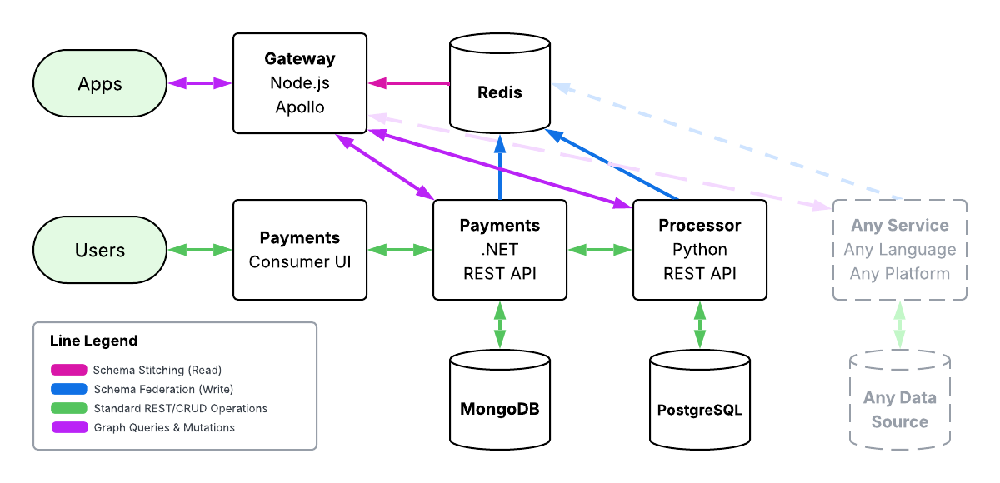

# Fintech DevCon 2025 Workshop

This workshop demonstrates how to federate GraphQL services using Apollo Federation, Redis, and multiple service technologies (.NET, Python, Node.js). You'll walk through building and connecting a federated API Gateway with services written in Python (PostgreSQL), .NET (MongoDB), and TypeScript (Redis-powered Gateway).

## Application Process Flow

This project contains 7 applications that demonstrate the following application flow:



📢 **REAL BIG FLASHY WARNING** 🚨

This project is provided to you "as-is". It has no warranty, it is not intended to be prescriptive, absolute, or secure. It is ONLY provided as a demonstration of a concept. It does **not** necessarily contain all of the best and latest security practices, unit tests, perfect code, or anything else that should be ever used directly in production without deep and thorough review. This is a **concept**, not a **recipe**. I have done my best to provide clear guidance and mostly clean code, but with that said, proceed with care. Thank you.

So, for any lawyers, attorneys, or armchair architects: DO NOT ATTEMPT TO USE ANY OF THIS CODE IN PRODUCTION WITHOUT THOROUGH REVIEW. Myself, and the company I represent, are in **NO** way responsible or liable for any use or misuse of this code.

⚠️ **IMPORTANT NOTES**

- This software is designed to be compatible with all modern Windows, Mac, and Linux systems
- This branch, `main`, can and will be overwritten by future Fintech Devcon presentations at any time
- This respository has specific branches for each year, which you can find as `master_{year}` when looking in branches
- Pull requests to any of these branches will likely be ignored

## Prerequisites

| Software | Version | Description |
|---|---|---|
| Visual Studio Code   | ≥ 1.102                         | Preferred editor for development (or alternatives like Rider)      |
| Git                  | ≥ 2.49                          | Distributed version control system                                 |
| Node Package Manager | ≥ 11                            | Package manager for Node.js applications.                          |
| Node.js              | ≥ 22                            | JavaScript runtime for running and building frontend/backend tools |
| TypeScript           | ≥ 5.8.3                         | Superset of JavaScript for static typing and tooling               |
| .NET SDK & ASP.NET   | ≥ 9                             | SDK and runtime for building and running .NET apps                 |
| Python               | ≥ 3.13                          | General-purpose scripting language (with `pip`)                    |
| Container Manager    | Docker, Rancher, Podman, Colima | Used to build and run containerized applications                   |

## Getting Started

For this workshop, all working code is available to you in the `main` branch.

### Clone the Repo

```bash
git clone https://github.com/dreaminhex/fintech_devcon.git
git fetch origin
git checkout main
```

### Folder Structure

Open the root folder where you cloned the repo (e.g. `fintech_devcon`) in Visual Studio Code.

Your folder structure will look like the following:

- 📂 `/assets` — Assets for this README
- 📂 `/examples` — Ready-to-run GraphQL queries
- 📂 `/gateway` — Node.js + TypeScript Apollo Gateway  
  - 🐳 `Dockerfile`
- 📂 `/infrastructure` — Seed scripts for databases  
  - 🐘 `init-db.sql` — PostgreSQL schema and seed  
  - 🍃 `mongo-init.js` — MongoDB schema and seed
- 📂 `/payments` — .NET 9 applications  
  - 📂 `/Payments.API` — ASP.NET Core Web API  
    - 🐳 `Dockerfile`
  - 📂 `/Payments.Domain` — Shared domain types and models
  - 📂 `/payments-ui` — React/Vite/Typescript UI 
    - 🐳 `Dockerfile`
- 📂 `/processor` — Python + PostgreSQL Ariadne API  
  - 🐳 `Dockerfile`
- ⚙️ `.gitignore` — We all know what this is  
- 📦 `docker-compose.yml` — Root Docker orchestration  
- 🧱 `fintech_devcon.sln` — .NET API & Blazor UI solution file  
- 📘 `README.md` - This document

## Application URLS

### .NET Payments Services

- 📈 GraphQL UI: [GraphQL Nitro](http://localhost:2022/graphql/)
- 🌐 Payments API: [Swagger](http://localhost:2022/swagger/index.html)
- 💸 Payments UI: [Valtay Financial](http://localhost:2023)

### Python Processor Service

- 🐍 GraphQL UI: [Graphiql UI](http://localhost:2024/graphql)

### Federated GraphQL Gateway

- 🔐 Login: [Authorized Login](http://localhost:2025/)
- 🚀 Gateway: [Gateway GraphQL](http://localhost:2025/graphql)
- 🛰 Voyager: [Voyager](http://localhost:2025/voyager)

## Option A: Cheatcode - Just Start Everything

If you just want to follow along and observe the demo, simply run (from the root directory):

```shell
docker compose build
docker compose up -d
```

This takes around 2-10 minutes (depending on your internet connection and processor speed) to pull all of the required Docker images and startup all services. You're always welcome to do this in advance as the conference's internet connection may be under heavy use.

Once done, open a browser to [http://localhost:2025/graphql](http://localhost:2025/graphql) and start running queries.

## Option B: Workshop - Step by Step

In this walkthrough, you’ll bring up each service, one by one, and see how each contributes to the federated architecture. We'll start with Redis (our cache), then launch the Python service, followed by the .NET services, and finally the Node.js Apollo Gateway.

## Step 1: The Federated Cache

Redis is used as a schema registry cache for Apollo Gateway to read SDLs (Schema Definition Language) published by other services.

From the `root` directory, run:

```shell
docker compose up -d redis
```

## Step 2: The Python Service

The Python service uses Flask, Ariadne, and PostgreSQL to expose a federated GraphQL service focused on processing and payment logic.

### Start the Postgres Container

PostgreSQL stores the backing data for the Python-based processor service.

From the `root` directory, run:

```shell
docker compose up -d postgres
```

🚀 The PostgeSQL image is configured to execute `infrastructure\init-db.sql`, which will populate the database with test data.

### Configure Service

For this demonstration, our Python service will use a virtual environment (`venv`) and `pip` to install dependencies.

1. From the `/processor` directory:
1. If you haven't done this yet, create a virtual env: `python -m venv venv`
1. Activate it
    - Windows Powershell: `venv\Scripts\Activate.ps1`
    - Windows Command Prompt: `venv\Scripts\activate`
    - MacOS (zsh): `source venv/bin/activate`
    - Linux: `source venv/bin/activate`
1. Install required packages: `pip install -r requirements.txt`
1. Select the virtual environment interpreter:
    - In VS Code
        - 🖼️ Windows `Ctrl`+`Shift`+`P`
        - 🍎 Mac: `⌘`+`Shift`+`P`
        - 🐧 Linux: `Ctrl`+`Shift`+`P`
    - Enter `Python: Select Interpreter`
    - Browse to `venv/bin` or `venv\Scripts`
    - Choose the correct `python` binary
1. From a terminal, tell Python to treat `/app` as a package: `python -m app.main`
1. Run the service: `python -m app`
1. Test the service:

- 🖼️ Windows (Powershell)

```powershell
Invoke-RestMethod -Uri http://localhost:2024/graphql `
    -Method POST `
    -Headers @{ "Content-Type" = "application/json" } `
    -Body '{ "query": "{ payments { id } }" }'
```

- 🖼️ Windows, 🍎 Mac, 🐧 Linux (curl)

```bash
curl -X POST http://localhost:2024/graphql -H "Content-Type: application/json" -d '{"query": "{ payments { id } }"}'
```

### Python Service Quickstart

If you've already done all of the installation steps, to quickstart, enter:

- 🖼️ Windows:

```shell
cd processor 
.venv\Scripts\Activate.ps1
python -m app
```

- 🍎 Mac or 🐧 Linux:

```bash
cd processor
source venv/bin/activate
python -m app
```

Now you can browse to [http://localhost:2024/graphql](http://localhost:2024/graphql) in your browser.

### Python Libraries Used

- Flask
- psycopg2
- GraphiQL
- SQLAlchemy
- Ariadne
- flasgger

## Step 3: The .NET Services

These services represent a mock UI and API for managing user accounts and payments, using MongoDB as a backing store.

### Start the Mongo Container

MongoDB stores user, account, and payment data for the .NET services.

From the `root` directory, run:

```shell
docker compose up -d mongo
```

🚀 The Mongo image is configured to execute `infrastructure\mongo-init.js`, which will populate the database with test data.

### Configure .NET Services

From the `payments` folder, run the following:

```shell
dotnet restore
dotnet build
```

### .NET Services Quickstart

#### **IMPORTANT NOTE**

You can run the .NET services via their Docker containers or through the Visual Studio Code debugger.

- When running via the debugger, the applications will reference `appsettings.json`.
- When running via Docker (via `docker-compose`), the applications will reference `appsettings.Docker.json`.

This is so that the Docker containers will reference the services in other Docker containers by name. You may need to adjust these settings if running any individual service manually.

1. From Visual Studio Code:
   1. 🖼️ Windows `Ctrl`+`Shift`+`P`
   1. 🍎 Mac: `⌘`+`Shift`+`P`
   1. 🐧 Linux: `Ctrl`+`Shift`+`P`
1. Type or choose → "Tasks: Run Task" → Run Both.
   - "Continue witrhout scanning the task output", if prompted
1. Open [http://localhost:2022/swagger](http://localhost:2022/swagger) in your browser.
1. Open [http://localhost:2022/graphiq](http://localhost:2022/graphiql) in your browser.
1. Open [http://localhost:2023](http://localhost:2023) in your browser.

### .NET Libraries Used

- GraphQL.NET
- MongoDB.Driver
- Microsoft WebAPI
- StackExchange.Redis

## Step 4: The Node.js Gateway

This is the Apollo Gateway that reads GraphQL schemas published to Redis and stitches them into a unified federated GraphQL API.

### Configure the Node.js Service

From the `/gateway` directory:

```bash
npm init -y
npm install typescript ts-node ts-node-dev @types/node --save-dev
npx tsc --init
```

#### Install Dependencies

```bash
npm install @apollo/server@^4 @apollo/gateway express cors body-parser graphql graphql-voyager ioredis @apollo/composition
```

#### Create `index.ts`

This file:

1. Connects to Redis
2. Loads federated service SDLs
3. Registers them with Apollo Gateway
4. Launches the Express GraphQL server

#### Update `package.json`

```json
"scripts": {
  "dev": "ts-node-dev --respawn --transpile-only src/index.ts"
}
```

#### Launch the Gateway

```shell
npm run dev
```

### Nodejs Libraries Used

- @apollo/server@^4
- @apollo/gateway
- @apollo/composition
- express
- cors
- body-parser
- graphql
- graphql-voyager
- ioredis
